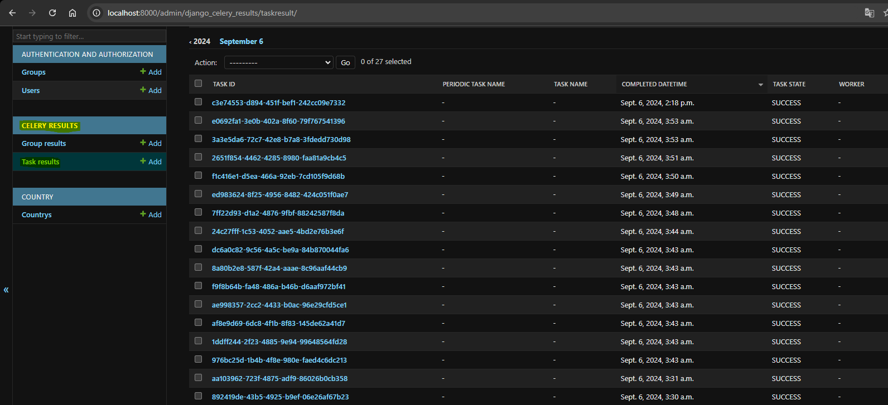
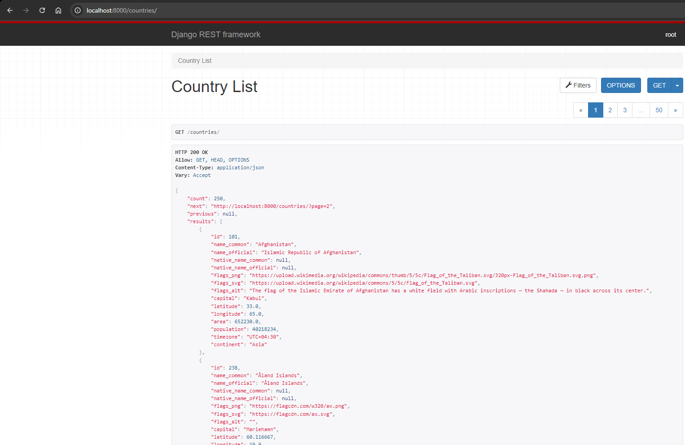
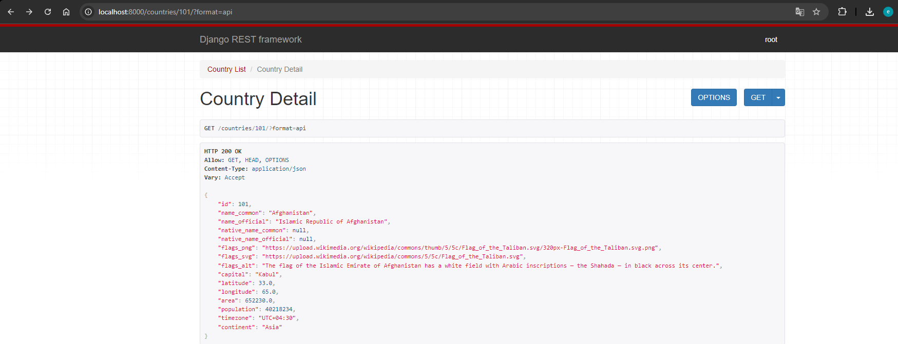

# Backend Megapixel

Este proyecto implementa una API utilizando Django, Celery, y Docker. La API recoge y almacena datos de países, ejecuta tareas programadas con Celery y proporciona un endpoint REST paginado para acceder a los datos.


## Pasos para el despliegue:

### 1. Clonar el repositorio

Clona el repositorio a tu máquina local utilizando `git`.

```bash
git clone https://github.com/usuario/proyecto.git
cd proyecto
```
Una vez clonado el repo podemos instalar las dependencias
```bash
pip install djangorestframework django mysqlclient celery python-decouple amqp django-celery-results requests
```

Luego debemos cambar el nombre de nuestro archivo .env.example a .env

### 2. Construir y levantar el entorno utilizando Docker.

```bash
docker-compose up
docker-compose build
```

```bash
docker-compose exec api python manage.py makemigrations
docker-compose exec api python manage.py migrate
```

### 3. Ejecutar la tarea programada.

Debemos primero iniciar el worker de celery
```bash
docker-compose exec api celery -A api worker -l info --concurrency=4
```

Luego iniciamos el Beat.
```bash
docker-compose exec api celery -A api beat -l info
```

### 4. Acceder al endpoint REST.

Debemos acceder a la lista de paises: 'http://localhost:8000/countries/'

O si queremos filtrar por id por ejemplo: 'http://localhost:8000/countries/70/'

### 5. Resultados Obtenidos.

Yo probe configurando la ejecucion de la tarea cada 1 minuto.



Si queremos ver las tareas debemos crearnos un superusuario.
```bash
python manage.py createsuperuser
```

Aca podemos ver el resultado de listar los paises



Y aca accediendo por id



### Muchas gracias por darme la oportunidad.